# Portfolio & Blog

個人作品集與技術筆記網站，同時作為全鏈路（前端／後端／資料庫／部署）工程能力的展示。

## Tech Stack

| 分類 | 技術 |
| --- | --- |
| 前端 | Next.js 15 (App Router) + TypeScript + Tailwind CSS |
| 後端 | FastAPI + SQLAlchemy (async) + Alembic |
| 資料庫 | PostgreSQL 16 |
| 部署 | Docker Compose + nginx + Certbot / Let's Encrypt |
| CI | GitHub Actions（lint、型別檢查、production build、後端測試、E2E、依賴安全稽核） |

## 功能

- 文章 / 作品內容管理（SSG + ISR，發布後即時更新頁面）
- 後台 CMS：Markdown 撰寫與即時預覽、草稿 / 發布狀態、分類與標籤管理
- 媒體庫：圖片上傳、封面圖片選擇（文章與作品皆支援）
- JWT 帳密登入（單一管理者，無公開註冊）
- 全文搜尋、標籤 / 分類頁、RSS 訂閱、深色模式
- SEO：sitemap、Open Graph、JSON-LD 結構化資料
- AI 助理：以網站已發布文章／關於我頁面為依據回答問題（keyword retrieval + citation 驗證，非向量搜尋），只回答有真實來源支撐的內容，找不到依據時明確拒答；後台可設定 provider（Gemini、OpenAI、Claude、OpenAI 相容服務皆已完成）與 API key（加密儲存）

## 畫面

| | |
| --- | --- |
| 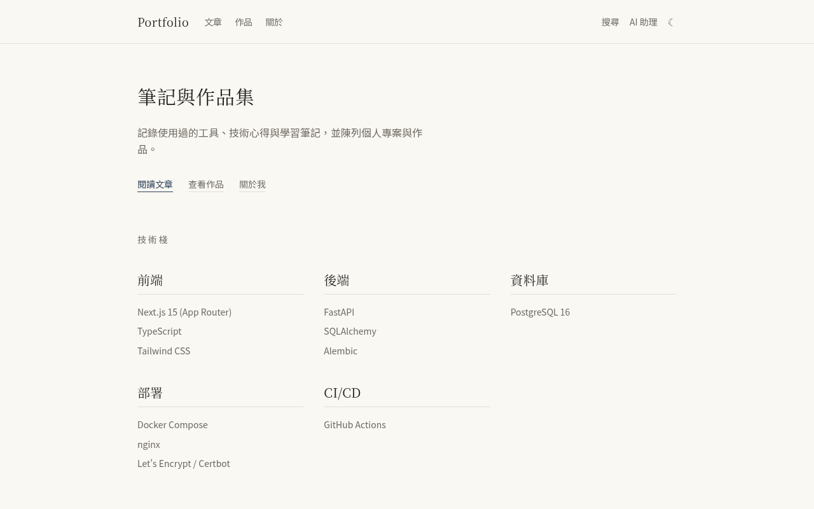 首頁 | 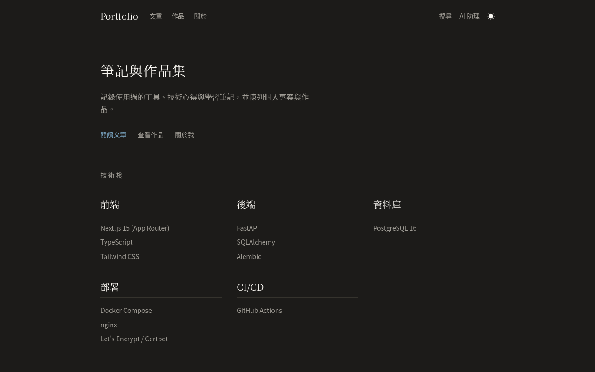 深色模式 |
| 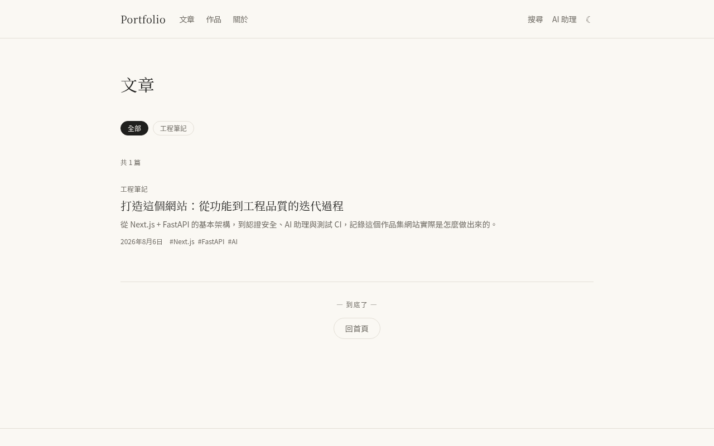 文章列表（分類篩選） | 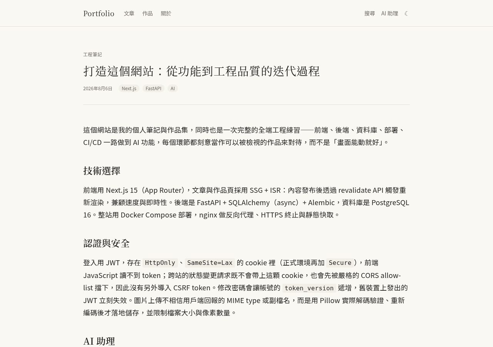 文章內容 |
| 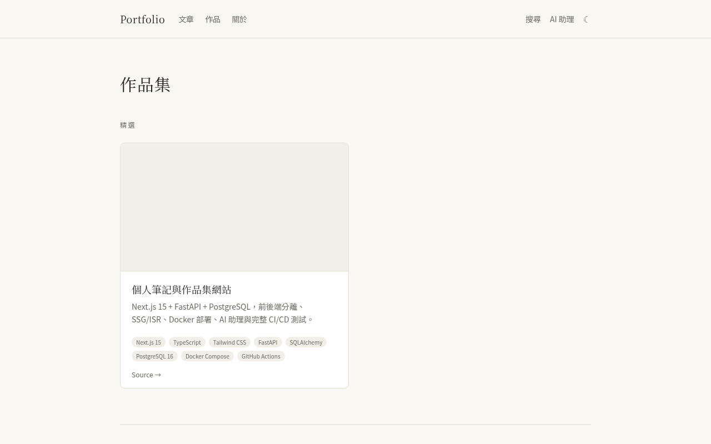 作品集 | 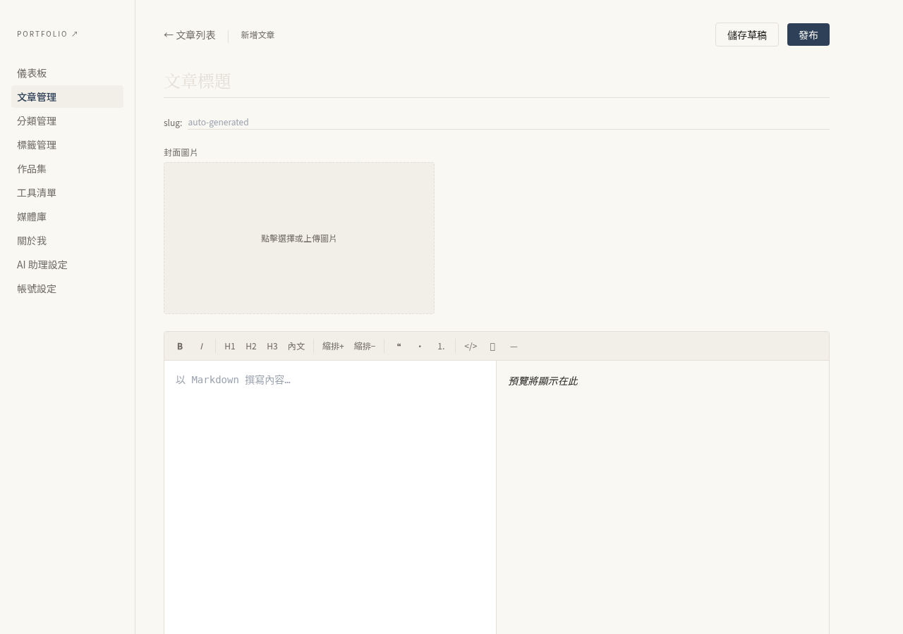 後台 Markdown 編輯器 |
| 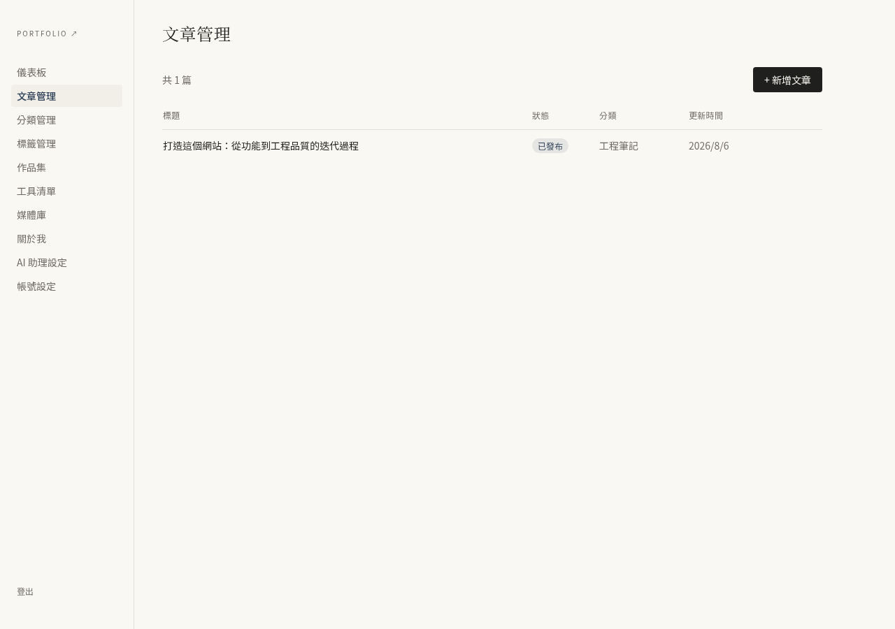 後台文章管理 | 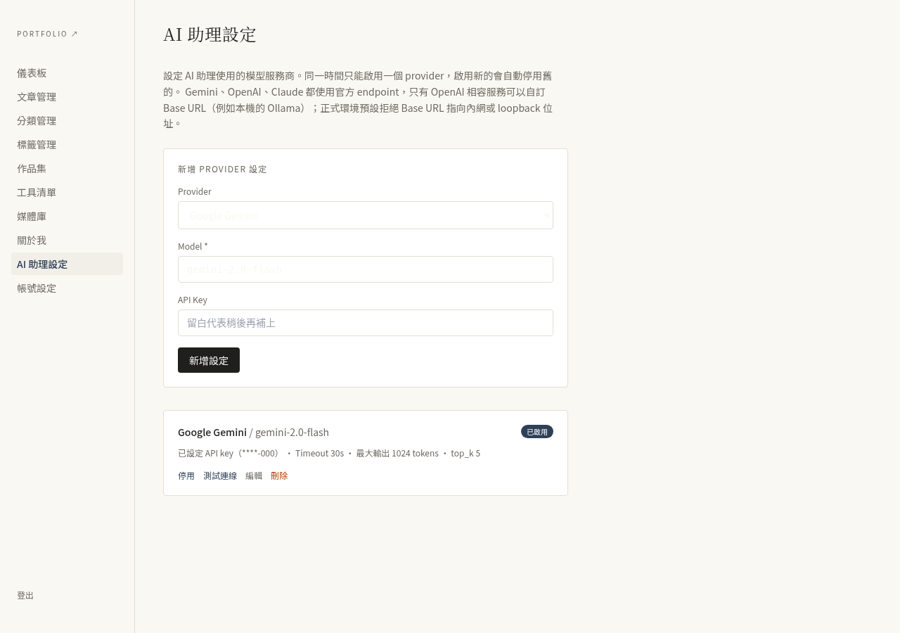 後台 AI 助理設定 |
| 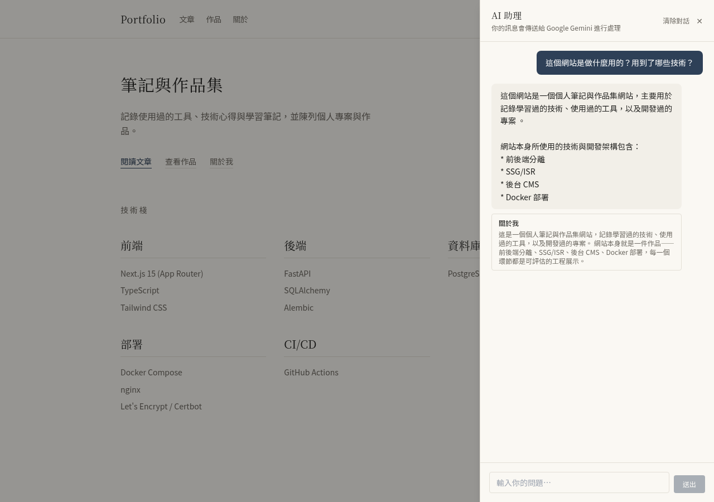 AI 助理：真實回答與來源引用卡片 | 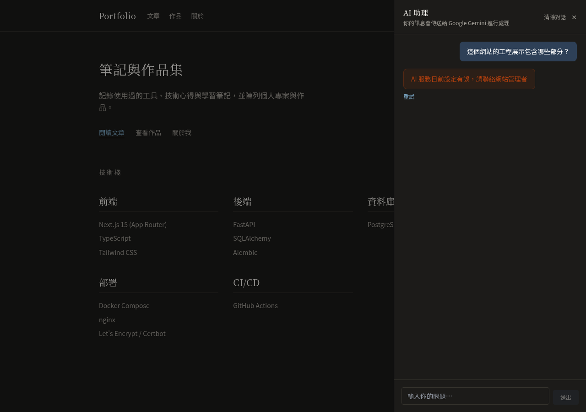 AI 助理：provider 失敗時的安全錯誤訊息 |

> 兩張 AI 助理截圖都是真實情境，不是擺拍的假畫面：左邊是真的呼叫 Gemini API 拿到的回答，來源引用卡片對應「關於我」的實際內容，點下去會連到真正的頁面；右邊是刻意設一把會被 provider 拒絕的 API key 測出來的錯誤處理畫面，前端正確顯示安全訊息與重試按鈕，不會讓使用者看到系統內部錯誤。

## 本機開發

需求：Docker 與 Docker Compose。

```bash
git clone https://github.com/leo031523/website.git
cd website
cp .env.example .env   # 填入資料庫密碼、JWT_SECRET 等必要變數

docker compose up -d
docker compose exec backend alembic upgrade head
```

建立管理者帳號（系統不提供公開註冊，僅單一管理者，重複執行不會建立重複帳號）：

```bash
docker compose exec -it backend python -m app.cli create-admin
```

會互動式詢問帳號、Email、密碼（密碼輸入不會顯示在畫面上，也不會留在 shell history）。若要在非互動環境（例如部署腳本）中自動建立，可改用環境變數：

```bash
docker compose exec \
  -e ADMIN_USERNAME=admin \
  -e ADMIN_EMAIL=you@example.com \
  -e ADMIN_PASSWORD=your_password \
  backend python -m app.cli create-admin
```

本機（未使用 Docker）開發時，在 `backend/` 目錄下啟用虛擬環境後執行同一支指令：

```bash
cd backend
python -m app.cli create-admin
```

完成後開啟 <http://localhost>，後台入口在 `/admin/login`。

## 架構

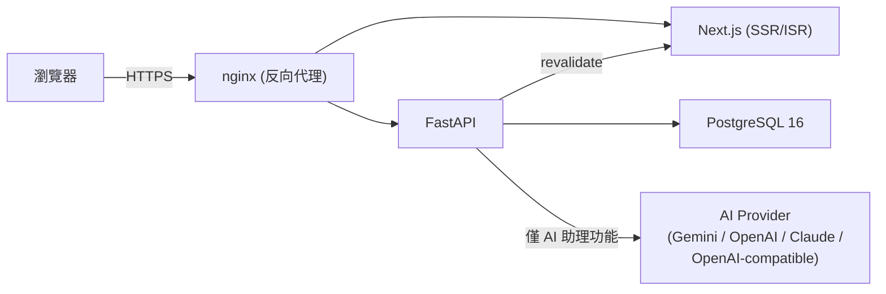

### 資料模型（ER 圖）

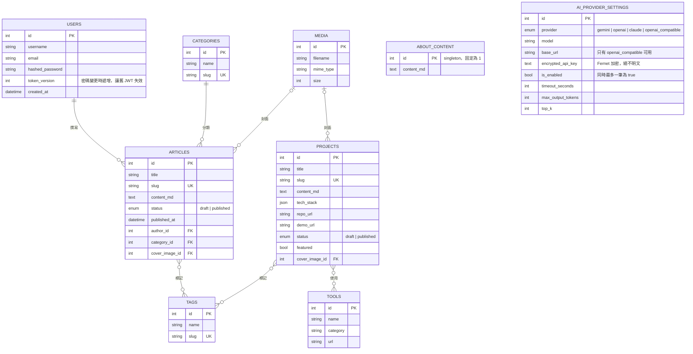

`ABOUT_CONTENT` 與 `AI_PROVIDER_SETTINGS` 沒有跟其他實體建立外鍵關聯——前者是單列（id 固定為 1）取代原本寫死在前端頁面的「關於我」文字，後者是 AI 助理的 provider 設定，兩者都是 AI 助理功能新增的資料表。

### AI 助理請求流程

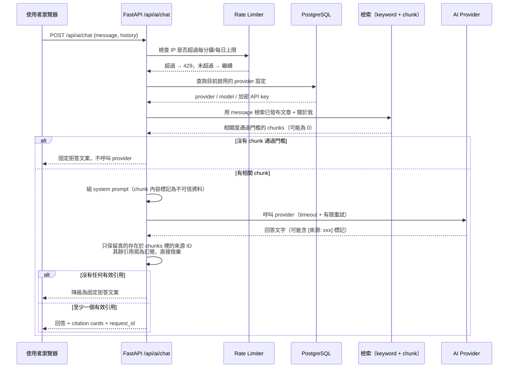

## 部署

正式環境使用 `docker-compose.prod.yml`，搭配 `scripts/` 下的備份（`backup.sh`）、還原（`restore.sh`）與 Certbot 憑證初始化（`init-certbot.sh`）腳本：

```bash
docker compose -f docker-compose.yml -f docker-compose.prod.yml up -d
```

`docker-compose.prod.yml` 會自動將 `APP_ENV` 設為 `production`、`COOKIE_SECURE` 設為 `true`。正式環境啟動時會強制驗證：

- `JWT_SECRET`、`REVALIDATE_SECRET`、`AI_MASTER_KEY` 都不是預設值，且長度至少 32 字元
- `COOKIE_SECURE` 必須為 `true`

任何一項不符合，後端會直接拒絕啟動並印出具體原因，避免用預設密鑰或非 HTTPS-only cookie 跑正式站。

`AI_MASTER_KEY` 用來加密資料庫中 AI provider 的 API key（Fernet 對稱加密），遺失這把 key 等於遺失所有已存的 API key，只能請管理者到後台重新輸入一次，不影響其他功能。

### AI 助理的 Local model 支援

「Local model」指的是**後端容器**能透過網路存取的 OpenAI-compatible endpoint（例如同一台主機或同一個 Docker network 內跑的 Ollama、LM Studio），不是讓公開網站直接呼叫訪客自己電腦上的模型——那是完全不同、也不安全的架構。

- Gemini、OpenAI、Claude 一律使用官方 endpoint，不開放自訂 host。
- 只有「OpenAI 相容服務」可以在後台設定 Base URL。
- 正式環境（`APP_ENV=production`）預設拒絕 Base URL 指向 loopback、link-local（含雲端 metadata IP）、內網位址，防止 SSRF。本機開發不受此限制。
- 若正式部署真的需要連線到內網的自架模型，把主機名稱加進環境變數 `AI_LOCAL_MODEL_ALLOWLIST`（逗號分隔），而不是放寬成接受任意 URL。
- 不要為了讓網站存取家用電腦上的模型，就把 Ollama／LM Studio 未經驗證地直接暴露到公開網路。

### 認證與 CSRF 防護

登入後的 session 用 `HttpOnly` cookie 保存 JWT（正式環境另外帶 `Secure`），前端 JS 讀不到 token，可防 XSS 竊取。CSRF 防護採用 `SameSite=Lax` cookie（跨站的狀態變更請求不會帶上此 cookie）疊加嚴格的 CORS allow-list（跨站請求會先觸發 preflight，未在白名單內的來源會被瀏覽器擋下），因此未額外導入 CSRF token 機制。

修改密碼會讓帳號的 `token_version` 遞增，此後所有裝置上舊的 JWT 立即失效（僅本次請求換發的新 token 有效），避免密碼外洩後舊 session 仍可用。

登入端點依來源 IP 做速率限制（每分鐘 5 次、每日 50 次，不論帳密是否正確都計入），防止暴力破解密碼；跟 AI 聊天 API 共用同一套記憶體內滑動視窗實作。

## 可觀察性與錯誤處理

- `GET /api/health`：存活檢查（liveness），process 有在跑就回 200，不觸碰資料庫。
- `GET /api/health/ready`：就緒檢查（readiness），實際嘗試連線資料庫並執行查詢；資料庫無法連線時回傳 503。
- 每個請求都會產生一個 `request_id`（回應標頭 `X-Request-ID`），並以 JSON 格式輸出到 stdout，包含 method、route、status、耗時；發生未預期例外時額外記錄錯誤類型。log 不包含密碼、JWT、API key 或請求/回應內容。
- 文章／作品發布後觸發前端 ISR revalidate 失敗時，會記錄該篇的 slug 與失敗原因（不會被靜默吞掉），但不會讓發布本身失敗。
- 帳號、slug、email 等 unique constraint 衝突一律回傳 `409`（附 `request_id` 方便對應 log），不會外洩 SQL 例外細節或變成未預期的 500。

## 測試

後端單元／整合測試（pytest，含 coverage 門檻 70%；上方 coverage badge 是最近一次執行的實際數字，非自動更新，改動測試涵蓋率時會手動同步）：

```bash
docker compose exec backend pytest tests/ -v --cov=app --cov-report=term-missing
```

前端 E2E（Playwright）需要一個真的在跑的後端＋資料庫＋已建立好的管理者帳號。本機執行方式：

```bash
docker compose up -d
docker compose exec backend alembic upgrade head
docker compose exec -e ADMIN_USERNAME=e2e-admin -e ADMIN_EMAIL=e2e@example.invalid \
  -e ADMIN_PASSWORD=<your_password> backend python -m app.cli create-admin

cd frontend
E2E_ADMIN_USERNAME=e2e-admin E2E_ADMIN_PASSWORD=<your_password> \
NEXT_PUBLIC_API_URL=/api PLAYWRIGHT_BASE_URL=http://localhost \
npx playwright test
```

CI 用的是完全獨立、一次性的 Postgres 與後端（見 `.github/workflows/ci.yml` 的 `e2e` job），不會碰到本機或正式環境的資料庫。E2E 涵蓋登入／建立草稿／發布／前台讀取，以及 AI 助理的鍵盤操作、來源引用、session 對話保存、速率限制與 provider 錯誤等情境；其中「看到答案與來源」這段用瀏覽器網路層攔截 `/api/ai/chat` 回傳固定回應，不會真的呼叫付費的 Gemini API——RAG 檢索與 citation 驗證邏輯已經在後端 integration test（mock provider）驗證過，E2E 這層只驗證前端收到成功回應後渲染是否正確。

## 依賴安全

CI 會執行 `npm audit`（擋 critical 漏洞）與後端 `ruff check`；Dependabot 每週自動檢查 npm、pip、Docker base image 與 GitHub Actions 的更新。目前已知且暫時無法在不做 Next.js 大版本升級下解決的殘留風險，記錄在 [`SECURITY_NOTES.md`](./SECURITY_NOTES.md)。

## 技術決策

幾個不是憑直覺、而是有明確取捨考量的決定（JWT 為什麼用 cookie 不用 localStorage、CSRF 為什麼沒有另外做 token、SSRF 怎麼防、AI 為什麼先用關鍵字檢索不用向量搜尋⋯），整理成「決定了什麼 → 為什麼 → 主要代價」的格式，記錄在 [`docs/DECISIONS.md`](./docs/DECISIONS.md)。

操作示範影片的分鏡腳本在 [`docs/DEMO_SCRIPT.md`](./docs/DEMO_SCRIPT.md)（影片本身尚待錄製）。

## AI 協作範圍與人工驗證方式

這個專案的程式碼是與 AI 協作完成的，這裡誠實說明協作的範圍與怎麼驗證品質，而不是含糊帶過：

- **AI 負責的部分**：大部分程式碼的初稿（後端 API、adapter、前端元件、測試案例）由 AI 撰寫，我負責提出需求、審查設計、驗收行為是否符合預期。
- **每個功能收工前，實際跑過，不是「看起來會動」就算數**：後端每個功能都有對應的 pytest（目前 187 個），關鍵安全修復（例如 API key 曾經意外寫進 log、focus trap 選到 disabled 元素）都用「先還原修復、確認測試真的會失敗、再改回來」的方式驗證測試本身有效，不是寫了測試卻沒有真的驗證它抓得到問題。前端功能除了 `tsc`/lint/production build 之外，會用瀏覽器（含無障礙操作、鍵盤導覽）實際跑過一次；牽涉到後台操作的流程會建立一次性測試帳號、實際登入操作、驗證完再把測試資料清除乾淨。
- **CI 全綠只是下限，不是唯一驗收標準**：每次改動在推上 GitHub 之前，會先在本機用跟 CI 等價的環境（獨立 Postgres、獨立後端、Playwright）完整跑過一次，抓到問題就地修掉，確認沒問題才推送；推送後也會實際查看 GitHub Actions 的執行結果，而不是假設「應該會過」。
- **對 AI 生成內容保持懷疑，尤其是「聽起來合理」的部分**：這份 README 裡列出的每一項安全機制、每一個數字（例如 coverage 百分比、測試數量），都是從實際執行結果讀出來的，不是憑印象寫的。AI 助理本身的 citation 驗證機制（見上方「AI 助理請求流程」）也是同一種精神的體現：不相信模型自己聲稱的東西，只相信可以獨立驗證的結果。

## 里程碑

- ✅ M0 專案骨架
- ✅ M1 後端 v1（資料模型 + JWT + 文章 API）
- ✅ M2 後台 CMS
- ✅ M3 公開前台（SSG/ISR + SEO）
- ✅ M4 部署（HTTPS + 自動備份）
- ✅ M5 作品集 v2
- ✅ M6 搜尋 / 標籤 / RSS / 深色模式
- ✅ M7 AI 助理（RAG 問答、多 provider adapter、E2E 測試）
