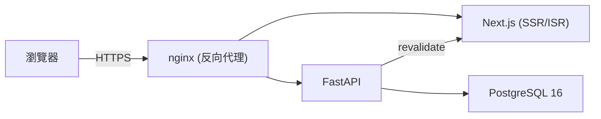

# Portfolio & Blog

個人作品集與技術筆記網站，同時作為全鏈路（前端／後端／資料庫／部署）工程能力的展示。

## Tech Stack

| 分類 | 技術 |
| --- | --- |
| 前端 | Next.js 15 (App Router) + TypeScript + Tailwind CSS |
| 後端 | FastAPI + SQLAlchemy (async) + Alembic |
| 資料庫 | PostgreSQL 16 |
| 部署 | Docker Compose + nginx + Certbot / Let's Encrypt |
| CI | GitHub Actions（lint、型別檢查、production build、後端測試、依賴安全稽核） |

## 功能

- 文章 / 作品內容管理（SSG + ISR，發布後即時更新頁面）
- 後台 CMS：Markdown 撰寫與即時預覽、草稿 / 發布狀態、分類與標籤管理
- 媒體庫：圖片上傳、封面圖片選擇（文章與作品皆支援）
- JWT 帳密登入（單一管理者，無公開註冊）
- 全文搜尋、標籤 / 分類頁、RSS 訂閱、深色模式
- SEO：sitemap、Open Graph、JSON-LD 結構化資料

## 本機開發

需求：Docker 與 Docker Compose。

```bash
git clone https://github.com/leo031523/website.git
cd website
cp .env.example .env   # 填入資料庫密碼、JWT_SECRET 等必要變數

docker compose up -d
docker compose exec backend alembic upgrade head
```

建立管理者帳號（系統不提供公開註冊，僅單一管理者，重複執行不會建立重複帳號）：

```bash
docker compose exec -it backend python -m app.cli create-admin
```

會互動式詢問帳號、Email、密碼（密碼輸入不會顯示在畫面上，也不會留在 shell history）。若要在非互動環境（例如部署腳本）中自動建立，可改用環境變數：

```bash
docker compose exec \
  -e ADMIN_USERNAME=admin \
  -e ADMIN_EMAIL=you@example.com \
  -e ADMIN_PASSWORD=your_password \
  backend python -m app.cli create-admin
```

本機（未使用 Docker）開發時，在 `backend/` 目錄下啟用虛擬環境後執行同一支指令：

```bash
cd backend
python -m app.cli create-admin
```

完成後開啟 <http://localhost>，後台入口在 `/admin/login`。

## 架構



## 部署

正式環境使用 `docker-compose.prod.yml`，搭配 `scripts/` 下的備份（`backup.sh`）、還原（`restore.sh`）與 Certbot 憑證初始化（`init-certbot.sh`）腳本：

```bash
docker compose -f docker-compose.yml -f docker-compose.prod.yml up -d
```

`docker-compose.prod.yml` 會自動將 `APP_ENV` 設為 `production`、`COOKIE_SECURE` 設為 `true`。正式環境啟動時會強制驗證：

- `JWT_SECRET`、`REVALIDATE_SECRET` 都不是預設值，且長度至少 32 字元
- `COOKIE_SECURE` 必須為 `true`

任何一項不符合，後端會直接拒絕啟動並印出具體原因，避免用預設密鑰或非 HTTPS-only cookie 跑正式站。

### 認證與 CSRF 防護

登入後的 session 用 `HttpOnly` cookie 保存 JWT（正式環境另外帶 `Secure`），前端 JS 讀不到 token，可防 XSS 竊取。CSRF 防護採用 `SameSite=Lax` cookie（跨站的狀態變更請求不會帶上此 cookie）疊加嚴格的 CORS allow-list（跨站請求會先觸發 preflight，未在白名單內的來源會被瀏覽器擋下），因此未額外導入 CSRF token 機制。

修改密碼會讓帳號的 `token_version` 遞增，此後所有裝置上舊的 JWT 立即失效（僅本次請求換發的新 token 有效），避免密碼外洩後舊 session 仍可用。

## 可觀察性與錯誤處理

- `GET /api/health`：存活檢查（liveness），process 有在跑就回 200，不觸碰資料庫。
- `GET /api/health/ready`：就緒檢查（readiness），實際嘗試連線資料庫並執行查詢；資料庫無法連線時回傳 503。
- 每個請求都會產生一個 `request_id`（回應標頭 `X-Request-ID`），並以 JSON 格式輸出到 stdout，包含 method、route、status、耗時；發生未預期例外時額外記錄錯誤類型。log 不包含密碼、JWT、API key 或請求/回應內容。
- 文章／作品發布後觸發前端 ISR revalidate 失敗時，會記錄該篇的 slug 與失敗原因（不會被靜默吞掉），但不會讓發布本身失敗。
- 帳號、slug、email 等 unique constraint 衝突一律回傳 `409`（附 `request_id` 方便對應 log），不會外洩 SQL 例外細節或變成未預期的 500。

## 依賴安全

CI 會執行 `npm audit`（擋 critical 漏洞）與後端 `ruff check`；Dependabot 每週自動檢查 npm、pip、Docker base image 與 GitHub Actions 的更新。目前已知且暫時無法在不做 Next.js 大版本升級下解決的殘留風險，記錄在 [`SECURITY_NOTES.md`](./SECURITY_NOTES.md)。

## 里程碑

- ✅ M0 專案骨架
- ✅ M1 後端 v1（資料模型 + JWT + 文章 API）
- ✅ M2 後台 CMS
- ✅ M3 公開前台（SSG/ISR + SEO）
- ✅ M4 部署（HTTPS + 自動備份）
- ✅ M5 作品集 v2
- ✅ M6 搜尋 / 標籤 / RSS / 深色模式
