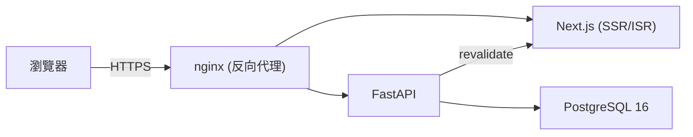

# Portfolio & Blog

個人作品集與技術筆記網站，同時作為全鏈路（前端／後端／資料庫／部署）工程能力的展示。

## Tech Stack

| 分類 | 技術 |
| --- | --- |
| 前端 | Next.js 15 (App Router) + TypeScript + Tailwind CSS |
| 後端 | FastAPI + SQLAlchemy (async) + Alembic |
| 資料庫 | PostgreSQL 16 |
| 部署 | Docker Compose + nginx + Certbot / Let's Encrypt |
| CI | GitHub Actions（lint、型別檢查、後端測試） |

## 功能

- 文章 / 作品內容管理（SSG + ISR，發布後即時更新頁面）
- 後台 CMS：Markdown 撰寫與即時預覽、草稿 / 發布狀態、分類與標籤管理
- 媒體庫：圖片上傳、封面圖片選擇（文章與作品皆支援）
- JWT 帳密登入（單一管理者，無公開註冊）
- 全文搜尋、標籤 / 分類頁、RSS 訂閱、深色模式
- SEO：sitemap、Open Graph、JSON-LD 結構化資料

## 本機開發

需求：Docker 與 Docker Compose。

```bash
git clone https://github.com/leo031523/website.git
cd website
cp .env.example .env   # 填入資料庫密碼、JWT_SECRET 等必要變數

docker compose up -d
docker compose exec backend alembic upgrade head
```

建立管理者帳號（系統不提供公開註冊，僅單一管理者）：

```bash
docker compose exec backend python -c "
from app.core.security import hash_password
print(hash_password('你的密碼'))
"
```

將產生的雜湊值連同帳號手動寫入 `users` 資料表，例如：

```bash
docker compose exec db psql -U portfolio -d portfolio_db \
  -c "INSERT INTO users (username, email, hashed_password) VALUES ('admin', 'you@example.com', '<上面產生的雜湊值>');"
```

完成後開啟 <http://localhost>，後台入口在 `/admin/login`。

## 架構



## 部署

正式環境使用 `docker-compose.prod.yml`，搭配 `scripts/` 下的備份（`backup.sh`）、還原（`restore.sh`）與 Certbot 憑證初始化（`init-certbot.sh`）腳本。

## 里程碑

- ✅ M0 專案骨架
- ✅ M1 後端 v1（資料模型 + JWT + 文章 API）
- ✅ M2 後台 CMS
- ✅ M3 公開前台（SSG/ISR + SEO）
- ✅ M4 部署（HTTPS + 自動備份）
- ✅ M5 作品集 v2
- ✅ M6 搜尋 / 標籤 / RSS / 深色模式
