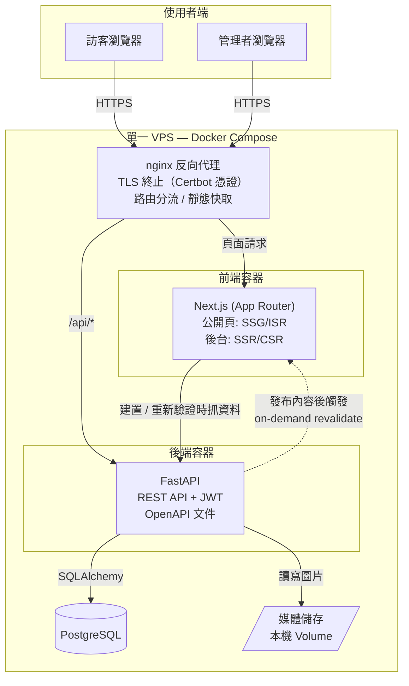
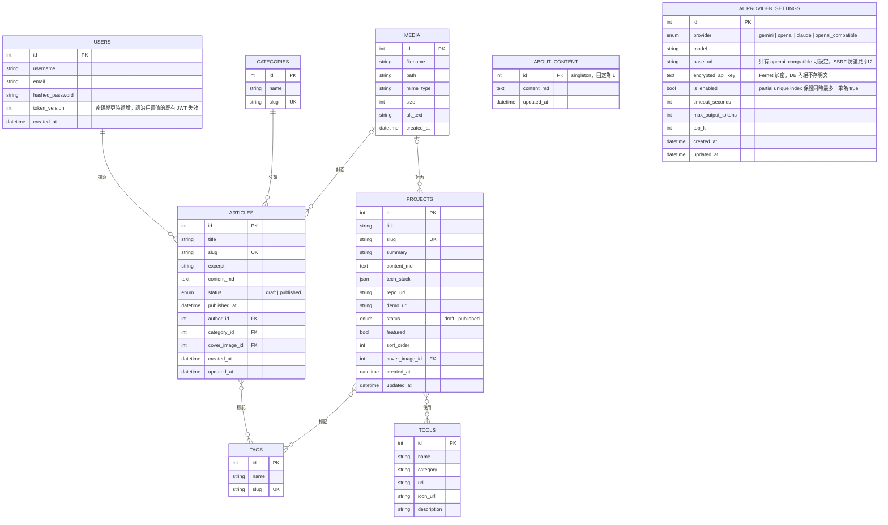
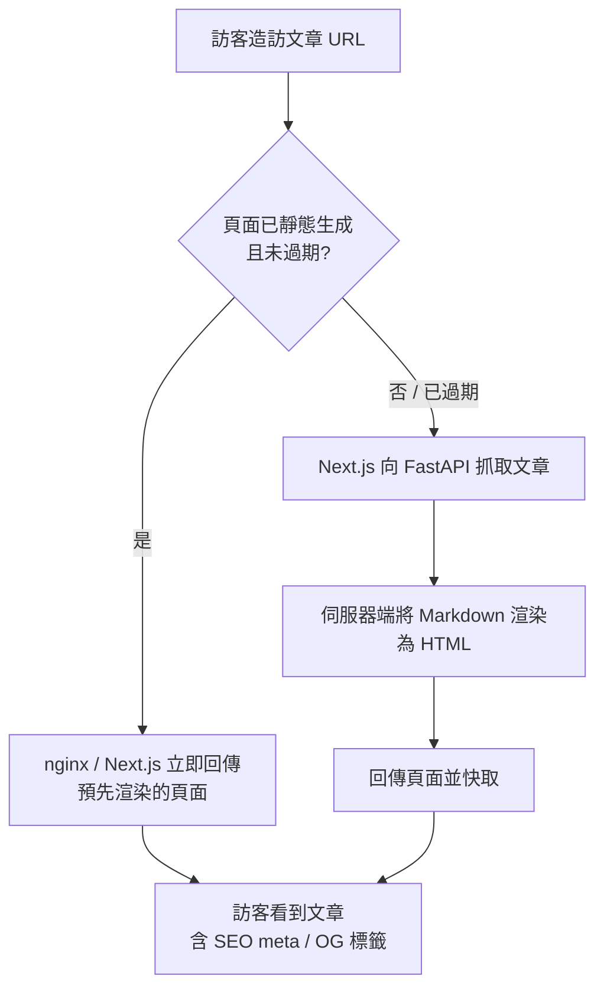
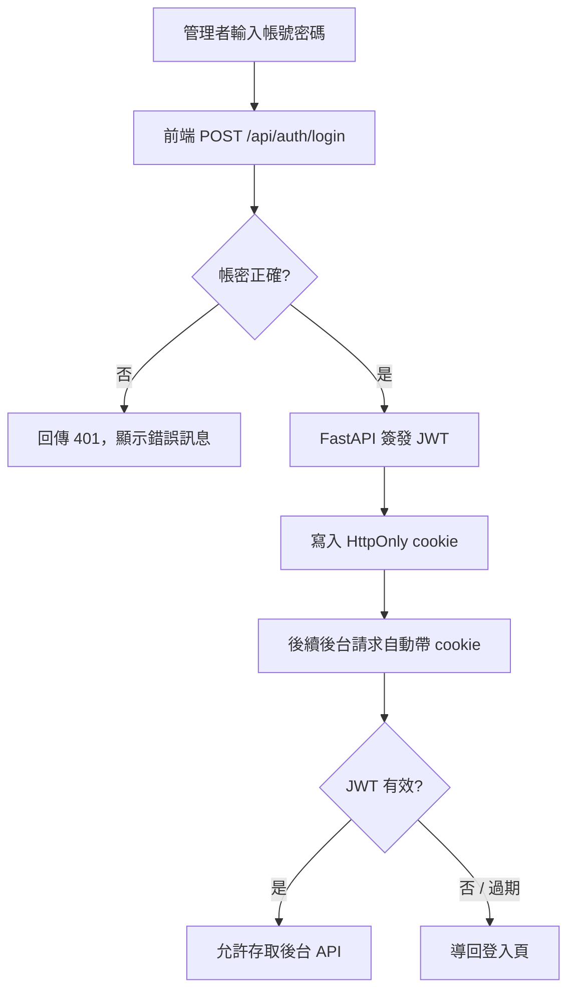
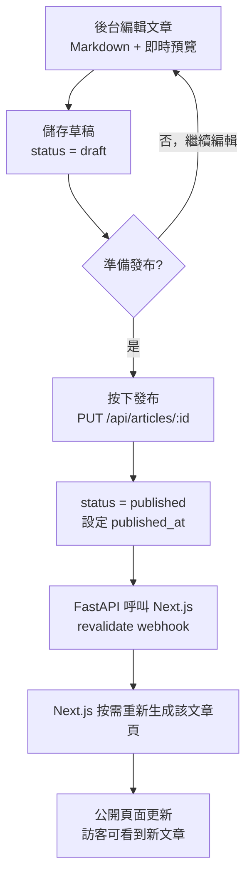
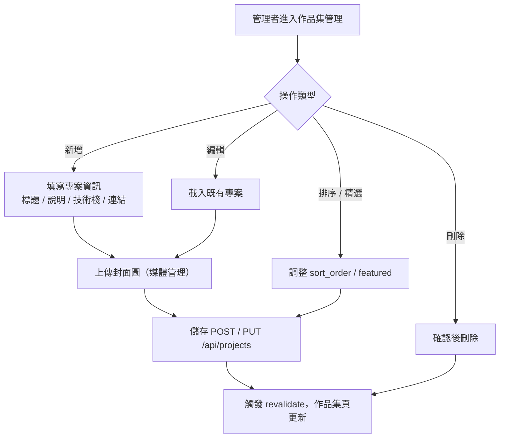
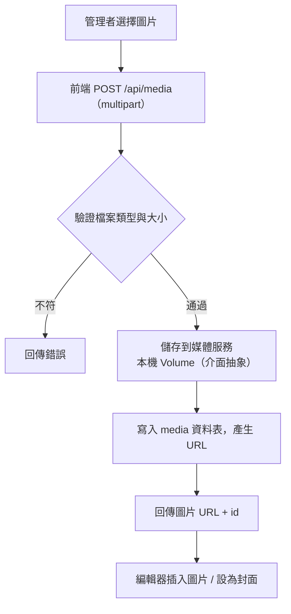
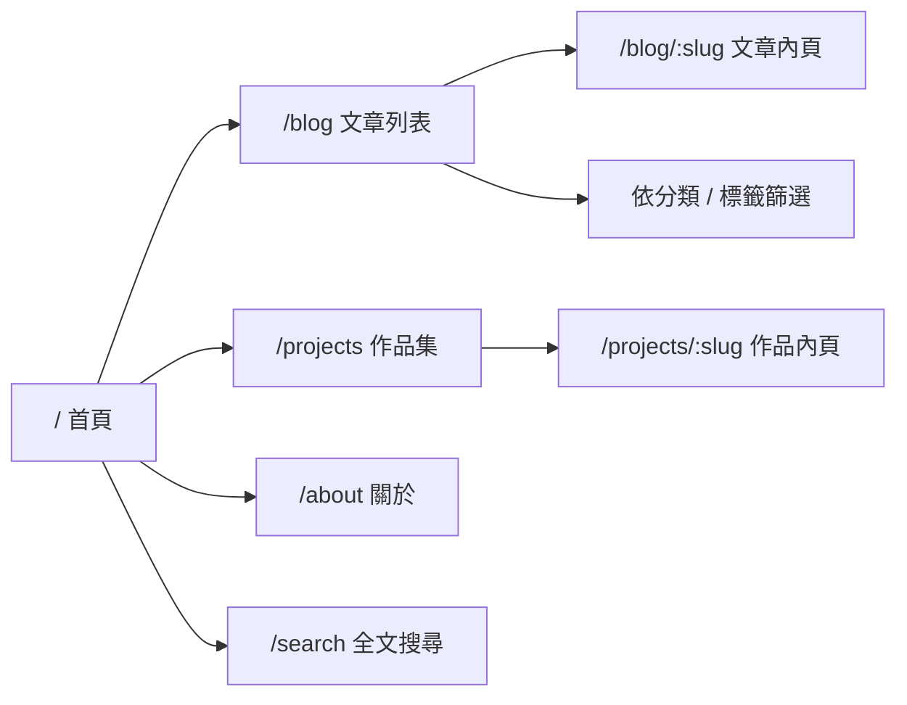
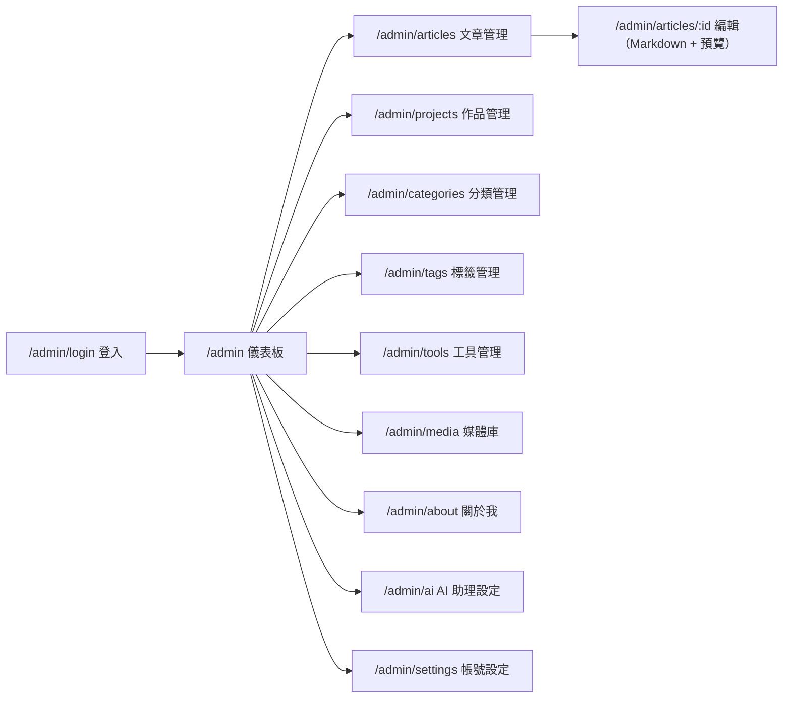
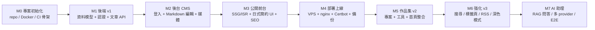

# 個人筆記與作品集網站 — 系統規格書與技術規劃

> **文件版本**：v1.4（M0–M7 已實作完成，詳見 §13）
> **前端策略**：Next.js（App Router，公開頁 SSG/ISR）
> **反向代理**：nginx（搭配 Certbot / Let's Encrypt 管理 TLS）
> **視覺風格**：日式簡約（詳見 §6）
> **專案性質**：個人作品集網站，兼具技術筆記、作品展示、後台 CMS 與 AI 助理
> **狀態**：M0–M7 已完成（含 AI 助理：RAG 問答、四種 provider adapter、Playwright E2E），細節見 `AI_FEATURE_REQUIREMENTS.md` 與 `docs/DECISIONS.md`
> **備註**：專案名稱目前為暫名，可自訂代號（例如 `nexus`、`atlas` 等）後全文替換。

---

## 目錄

1. [專案總覽](#1-專案總覽)
2. [範圍與分階段交付](#2-範圍與分階段交付)
3. [使用者故事](#3-使用者故事)
4. [功能需求](#4-功能需求)
5. [非功能需求](#5-非功能需求)
6. [視覺設計風格（日式簡約）](#6-視覺設計風格日式簡約)
7. [系統架構](#7-系統架構)
8. [資料模型（ERD）](#8-資料模型erd)
9. [API 規格](#9-api-規格)
10. [流程圖](#10-流程圖)
11. [網站地圖與頁面](#11-網站地圖與頁面)
12. [安全設計](#12-安全設計)
13. [路線圖與里程碑](#13-路線圖與里程碑)
14. [文件清單與後續](#14-文件清單與後續)
15. [附錄：建議的專案目錄結構](#15-附錄建議的專案目錄結構)

---

## 1. 專案總覽

### 1.1 專案目標

打造一個**本身即作品**的個人網站，同時承擔三個角色：

- **知識筆記庫**：紀錄使用過的工具、技術心得、學習筆記。
- **作品集展示**：陳列個人專案與作品，方便招募方快速了解能力。
- **作品本身**：網站的前後端、後台、架構、設計與工程流程，本身就是一件可被評估的作品。

因為網站「本身就是作品」，**乾淨的架構、清楚的前後端分離、API 設計、一致的視覺風格、測試與部署流程，對招募方的展示價值不輸最終畫面**。本規劃文件、架構決策與工程紀律，都被視為交付物的一部分。

### 1.2 目標使用者（Personas）

| Persona | 身分 | 目標 | 對應功能 |
|---|---|---|---|
| **訪客 / 招募方** | 未登入的一般讀者 | 快速了解你做過什麼、讀技術筆記、看作品 | 公開前台、文章閱讀、作品集瀏覽 |
| **管理者（你）** | 唯一具寫入權限者 | 撰寫與發布文章、管理作品、維護網站內容 | 後台 CMS、認證、內容編輯 |

### 1.3 核心價值主張

- 招募方能在 1–2 分鐘內掌握你的技術背景與作品。
- 你能用 Markdown 持續累積筆記，發布後透過 ISR 即時上線、SEO 友善。
- 採 Next.js（SSG/ISR）+ FastAPI + PostgreSQL + Docker 的主流技術棧、清楚的前後端分離，展示全鏈路能力。
- 整體採**日式簡約**視覺風格——安靜、克制、留白、易讀（見 §6）。

### 1.4 成功指標

- 後台發布文章後，公開頁面於數秒內反映更新（ISR）。
- 公開頁面具完整 SEO meta 與 Open Graph，可被搜尋引擎索引、社群分享預覽正常。
- 首頁與文章頁 LCP（最大內容繪製）< 2.5 秒。
- 視覺呈現符合 §6 日式簡約設計規範。
- 程式碼具型別檢查、Lint、基本測試與 CI。

---

## 2. 範圍與分階段交付

### 2.1 分階段交付（Phasing）

| 階段 | 範圍 | 交付目標 |
|---|---|---|
| **v1（MVP）** | 文章/筆記 CRUD、後台 CMS（登入、草稿/發布）、公開閱讀頁、Markdown 編輯與渲染、媒體上傳、日式簡約設計系統 | 可上線的部落格 + 後台 |
| **v2** | 作品集區（專案展示、用過的工具）、首頁整合、精選與排序 | 完整作品集網站 |
| **v3** | 標籤/分類瀏覽、全文搜尋、RSS、深色模式（沿用日式簡約）、瀏覽分析、留言（選配） | 體驗強化與成長功能 |

### 2.2 不在範圍內（Out of Scope，至少 v1–v2）

- 多使用者 / 公開註冊系統（系統設計為單一管理者）。
- 金流、訂閱、電商功能。
- 即時通訊、即時協作。
- 行動原生 App（採 RWD 網頁因應行動裝置）。

---

## 3. 使用者故事

### 訪客 / 招募方

- 作為訪客，我想在首頁快速看到「這個人是誰、做過什麼」，以便決定是否深入。
- 作為訪客，我想瀏覽文章列表並依分類/標籤篩選，以便找到感興趣的主題。
- 作為訪客，我想閱讀一篇排版良好、含程式碼區塊的技術文章。
- 作為招募方，我想瀏覽作品集，看到每個專案的說明、使用技術與連結（原始碼/Demo）。
- 作為訪客，我把文章連結分享到 LinkedIn/Slack 時，希望出現正確的標題與預覽圖。

### 管理者（你）

- 作為管理者，我想用帳密登入後台，且其他人無法登入。
- 作為管理者，我想用 Markdown 撰寫文章並即時預覽排版。
- 作為管理者，我想先存成草稿，準備好再發布。
- 作為管理者，我想上傳圖片並插入文章，或設為封面。
- 作為管理者，我想管理作品集項目（新增、編輯、排序、設為精選）。
- 作為管理者，我想管理分類、標籤與「用過的工具」清單。

---

## 4. 功能需求

### 4.1 公開前台

- **FR-1** 首頁：個人簡介、精選文章、精選作品入口。
- **FR-2** 文章列表頁：分頁、依分類/標籤篩選、依發布時間排序，僅顯示已發布文章。
- **FR-3** 文章內頁：Markdown 渲染（含程式碼語法高亮）、封面圖、發布時間、分類標籤；伺服器端輸出 SEO meta 與 OG 標籤。
- **FR-4** 作品集列表頁（v2）：卡片式展示，支援精選置頂與排序。
- **FR-5** 作品內頁（v2）：專案說明、使用技術棧、相關工具、原始碼/Demo 連結。
- **FR-6** 全站響應式設計（RWD），並遵循 §6 日式簡約設計規範，支援手機、平板、桌機。

### 4.2 後台 CMS

- **FR-7** 登入頁與受保護的後台路由（未登入導回登入頁）。
- **FR-8** 後台儀表板：內容統計總覽（文章數、作品數、草稿數）。
- **FR-9** 內容編輯介面以左右分欄呈現 Markdown 原文與即時預覽。

### 4.3 認證

- **FR-10** 管理者以帳號 + 密碼登入。
- **FR-11** 系統不提供公開註冊；管理者帳號於初始化時建立（seed 或 CLI 指令）。
- **FR-12** 登入成功簽發 JWT，存於 HttpOnly cookie；登出清除。
- **FR-13** 後台 API 一律驗證 JWT，無效或過期則拒絕。

### 4.4 文章管理

- **FR-14** 建立、讀取、更新、刪除文章（CRUD）。
- **FR-15** 文章具狀態：`draft`（草稿）/ `published`（已發布）。
- **FR-16** `slug` 自動由標題產生，可手動覆寫，且全站唯一。
- **FR-17** 文章可指定分類（單一）與標籤（多個）。
- **FR-18** 發布文章時設定 `published_at`，並觸發前端頁面按需重新生成（ISR on-demand revalidate）。

### 4.5 作品集管理（v2）

- **FR-19** 專案 CRUD。
- **FR-20** 專案可設定技術棧、原始碼連結、Demo 連結、封面圖。
- **FR-21** 專案可標記為精選（`featured`）並自訂排序（`sort_order`）。
- **FR-22** 專案可關聯多個「工具」。

### 4.6 媒體管理

- **FR-23** 上傳圖片，驗證檔案類型與大小。
- **FR-24** 圖片儲存於後端媒體服務（v1 為本機 Volume，介面抽象化以便日後改用 S3 / Cloudflare R2）。
- **FR-25** 上傳後回傳可公開存取的 URL，供編輯器插入或設為封面。

### 4.7 分類與標籤

- **FR-26** 分類與標籤的 CRUD（後台）。
- **FR-27** 「用過的工具」清單管理（名稱、分類、圖示、連結、說明）。

---

## 5. 非功能需求

| 類別 | 需求 |
|---|---|
| **效能** | 公開頁面以 SSG/ISR 預先生成；首頁與文章頁 LCP < 2.5s；API p95 回應 < 200ms；靜態資源經 nginx 快取與壓縮。 |
| **SEO** | 公開頁面於伺服器端預先渲染，爬蟲與社群預覽機器人可直接取得完整 HTML。每頁具獨立 `title` / `description` / `canonical`；Open Graph 與 Twitter Card；自動產生 `sitemap.xml` 與 `robots.txt`；文章頁加入 JSON-LD（`Article`）結構化資料。 |
| **設計一致性** | 全站遵循 §6 日式簡約設計系統；色票、字體、間距集中管理為 design tokens，確保視覺一致。 |
| **安全** | 全站 HTTPS（nginx + Certbot）；JWT 存 HttpOnly cookie；密碼以 bcrypt/argon2 雜湊；輸入以 Pydantic 驗證；CORS 白名單；登入端點加上速率限制。 |
| **無障礙** | 語意化 HTML、鍵盤可操作、足夠色彩對比、圖片具 alt。 |
| **相容性** | 支援 Chrome / Firefox / Safari / Edge 最新兩個版本；RWD 適配主流裝置尺寸。 |
| **可維護性** | 後端 ruff + black、Pydantic 型別；前端 TypeScript + ESLint + Prettier；關鍵流程具測試；GitHub Actions 跑 Lint/測試。 |
| **可觀測性** | 結構化日誌；錯誤追蹤（如 Sentry，選配）。 |
| **備份與還原** | PostgreSQL 每日自動備份；媒體檔定期備份；可還原驗證。 |

---

## 6. 視覺設計風格（日式簡約）

整體追求「安靜、克制、留白、自然」的日式簡約美學，靈感來自無印良品（MUJI）、Kinfolk 雜誌、和紙與墨色、枯山水。

### 6.1 設計理念

- **間（Ma）／留白**：以大量負空間營造呼吸感，不填滿版面；留白本身就是設計。
- **侘寂（Wabi-sabi）**：以簡約、克制、自然質感為美；少即是多。
- **静けさ（寧靜）**：氛圍安靜沉穩，互動與轉場緩和不張揚。
- **層級以留白與大小表現**，而非靠粗體與鮮豔色彩堆疊。

### 6.2 色彩（Color Tokens）

低彩度，以和紙米白為底、墨色為字，單一沉穩主色點綴；朱紅僅在極少數需強調處使用。

| 用途 | 名稱 | 色碼（建議） |
|---|---|---|
| 背景（主） | 和紙米白 | `#FAF8F3` |
| 背景（次／卡片） | 淺米 | `#F2EFE8` |
| 文字（主） | 墨 / Sumi | `#1F1F1D` |
| 文字（次） | 淡墨 | `#6E6A63` |
| 主色 / 連結 | 藍染（Ai indigo） | `#2E4057` |
| 強調（極少用） | 朱 / Vermillion | `#B7410E` |
| 分隔線 / 邊框 | 細灰 | `#E3DFD6` |

> 朱紅僅用於極少數需要強調之處（如「目前所在」、關鍵 CTA），避免破壞整體寧靜感。

### 6.3 字體與排版（Typography）

- **標題**：明體 / Mincho 襯線（如 Noto Serif TC、Shippori Mincho 風格），帶傳統印刷氣質。
- **內文**：黑體 / 無襯線（如 Noto Sans TC），清爽易讀。
- **行距**：中文內文 `line-height` 約 1.8，字距（`letter-spacing`）略放寬，營造留白。
- **字重**：偏細（light / regular），避免厚重。
- **對比**：以「大小與留白」表現層級，而非粗體與顏色。

### 6.4 間距與版面（Spacing & Layout）

- 採固定間距尺度（4 的倍數：8 / 16 / 24 / 40 / 64 …），section 之間留大量空白。
- 內文最大寬度收斂（約 680–720px），兩側留白。
- 非對稱但對齊嚴謹的網格；元素貼齊基線。

### 6.5 元件與質感（Components）

- **邊框**：以 1px 細灰 hairline 取代陰影；圓角極小（0–4px）。
- **陰影**：避免，或僅用極淡柔和陰影。
- **按鈕**：簡單方正，主色或墨色，hover 以淡化／底線表現。
- **圖片**：四周留白，色調偏自然柔和，避免濃烈濾鏡。
- **卡片**：以留白與細線分隔，不堆疊重裝飾。

### 6.6 動效（Motion）

- 轉場緩慢、`ease-out`，時長偏長（200–400ms），呈現沉穩。
- 捲動淡入（fade／slide）幅度小而克制。

### 6.7 實作對應

- 以 **Tailwind CSS** 設定自訂 theme（色票／字體／間距），集中管理為 design tokens。
- 字體以 `next/font` 載入 Noto Serif TC（標題）與 Noto Sans TC（內文）。
- 深色模式（v3）保留同樣克制原則：以深墨底（如 `#1C1B19`）配米白字。

---

## 7. 系統架構

### 7.1 技術棧總覽

| 層 | 技術 | 說明 |
|---|---|---|
| 前端 | **Next.js（App Router）+ TypeScript** | 公開頁面用 SSG/ISR，後台用 SSR/CSR；SEO 友善。 |
| 樣式 | **Tailwind CSS + 自訂 design tokens** | 集中管理日式簡約色票／字體／間距（見 §6）。 |
| 字體 | **Noto Serif TC（標題）+ Noto Sans TC（內文）**，以 `next/font` 載入 | 明體標題 + 黑體內文。 |
| Markdown 渲染 | react-markdown / MDX + 語法高亮 | 將文章 Markdown 轉為 HTML（伺服器端渲染，需淨化）。 |
| 後端 | **FastAPI（Python）** | REST API、JWT 認證、自動產生 OpenAPI/Swagger 文件。 |
| ORM / 遷移 | **SQLAlchemy + Alembic** | 資料存取與資料庫版本遷移。 |
| 資料庫 | **PostgreSQL** | 主資料儲存；為全文搜尋、JSON 欄位等預留能力。 |
| 媒體儲存 | 本機 Volume（介面抽象） | v1 本機，日後可換 S3 / Cloudflare R2。 |
| 反向代理 | **nginx（+ Certbot / Let's Encrypt）** | TLS 終止、路由分流、靜態資源快取。 |
| 容器化 | **Docker + Docker Compose** | 一鍵啟動所有服務，環境一致。 |
| CI | GitHub Actions | Lint、測試、（選配）自動部署。 |

### 7.2 架構圖



### 7.3 元件說明

- **nginx（反向代理）**：對外唯一入口，負責 TLS 終止與路由分流。一般頁面請求轉發給 Next.js 容器，`/api/*` 轉發給 FastAPI，並可對靜態資源加上快取與壓縮。TLS 憑證以 Certbot（Let's Encrypt）取得並設定自動續期（cron / systemd timer 或 certbot 容器）。
  > 取捨：相較 Caddy 自動處理 HTTPS，nginx 需多一步憑證管理；但 nginx 更普遍、生態成熟、調校彈性高，作為履歷展示也很常見。
- **Next.js（前端）**：公開頁面以 SSG 建置、以 ISR 在內容更新時按需重新生成；後台頁面採 SSR/CSR，需登入。資料一律透過 FastAPI 取得。正式環境以 `next start` 運行於 Node。
- **FastAPI（後端）**：唯一的資料來源與寫入端，提供 REST API，內建 Swagger UI（`/docs`）。發布內容後呼叫 Next.js 的 revalidate webhook。
- **PostgreSQL**：主資料庫；SQLAlchemy 操作、Alembic 管理 schema 遷移。
- **媒體儲存**：以服務介面（interface）封裝，v1 實作為本機檔案，日後可替換為物件儲存而不影響其他程式碼。

### 7.4 部署拓樸

所有服務以 Docker Compose 定義，於單一 VPS（如 Hetzner / DigitalOcean，約 USD 5–6/月）啟動：

- `nginx`：反向代理 + TLS 終止（Certbot 憑證 + 自動續期）。
- `frontend`：Next.js（`next start`，Node 容器）。
- `backend`：FastAPI（Uvicorn/Gunicorn）。
- `db`：PostgreSQL，資料以具名 Volume 持久化。
- `certbot`：取得與續期 TLS 憑證（companion 容器或 host 排程）。
- 媒體檔以具名 Volume 持久化；資料庫每日備份。

---

## 8. 資料模型（ERD）

### 8.1 ER 圖



`ABOUT_CONTENT` 與 `AI_PROVIDER_SETTINGS` 是 AI 助理功能新增的資料表，跟其他實體之間沒有外鍵關聯：`ABOUT_CONTENT` 是單列（id 固定為 `SINGLETON_ID = 1`）取代原本寫死在 Next.js page 裡的「關於我」文字，讓後端可以檢索；`AI_PROVIDER_SETTINGS` 是 provider 設定，AI 聊天請求執行時讀取目前 `is_enabled=true` 的那一筆。

### 8.2 實體說明

- **USERS**：管理者帳號。系統設計為單一管理者，故此表通常只有一筆；`token_version` 讓修改密碼後可以讓舊裝置上發出的 JWT 立即失效，不需要維護 token 黑名單。
- **ARTICLES**：文章/筆記。內容以 Markdown 原文（`content_md`）儲存，由前端伺服器端渲染。`status` 控制草稿/發布，AI 助理檢索時只會讀取 `published` 的文章。
- **PROJECTS**：作品集項目（v2）。`tech_stack` 以 JSON 陣列存放技術名稱；`featured` 與 `sort_order` 控制展示順序。
- **CATEGORIES / TAGS**：分類（文章與專案各屬一個分類）與標籤（多對多）。
- **TOOLS**：「用過的工具」清單，可與專案多對多關聯。
- **MEDIA**：上傳的圖片等媒體；文章與專案以 `cover_image_id` 參照作為封面。上傳時會用 Pillow 實際解碼驗證圖片格式，不信任用戶端提供的 MIME type。
- **ABOUT_CONTENT**：「關於我」內容，後台可編輯的單列資料（AI 助理功能新增）。
- **AI_PROVIDER_SETTINGS**：AI provider 設定（AI 助理功能新增），`encrypted_api_key` 只存加密後的密文，後台讀取時只回傳遮罩後的尾碼。

### 8.3 關聯表（多對多）

多對多關係以中介表實作：

- `article_tags`（`article_id`, `tag_id`）
- `project_tags`（`project_id`, `tag_id`）
- `project_tools`（`project_id`, `tool_id`）

---

## 9. API 規格

### 9.1 慣例

- **風格**：RESTful，路徑前綴 `/api`，JSON 格式。
- **認證**：後台寫入端點需有效 JWT（HttpOnly cookie）；公開讀取端點預設僅回傳 `published` 內容。
- **文件**：FastAPI 自動產生 OpenAPI 與 Swagger UI（`/docs`）、ReDoc（`/redoc`）。
- **錯誤格式**：標準 HTTP 狀態碼 + 一致的 JSON 錯誤結構。

### 9.2 端點清單

| 方法 | 路徑 | 權限 | 說明 |
|---|---|---|---|
| POST | `/api/auth/login` | 公開 | 帳密登入，簽發 JWT |
| POST | `/api/auth/logout` | 管理者 | 登出，清除 cookie |
| GET | `/api/auth/me` | 管理者 | 取得目前登入者資訊 |
| PUT | `/api/auth/me` | 管理者 | 更新目前帳號（使用者名稱／Email／密碼，需帶目前密碼確認） |
| GET | `/api/articles` | 公開 | 文章列表（分頁、依分類/標籤篩選；公開僅回 `published`） |
| GET | `/api/articles/{slug}` | 公開 | 取得單篇文章（未登入僅回 `published`） |
| GET | `/api/articles/id/{article_id}` | 管理者 | 依 ID 取得文章（含草稿，供後台編輯器使用） |
| POST | `/api/articles` | 管理者 | 新增文章 |
| PUT | `/api/articles/{id}` | 管理者 | 更新文章（含發布） |
| DELETE | `/api/articles/{id}` | 管理者 | 刪除文章 |
| GET | `/api/projects` | 公開 | 作品列表（未登入僅回 `published`） |
| GET | `/api/projects/{slug}` | 公開 | 取得單一作品（未登入僅回 `published`） |
| GET | `/api/projects/id/{project_id}` | 管理者 | 依 ID 取得作品（含草稿，供後台編輯器使用） |
| POST | `/api/projects` | 管理者 | 新增作品 |
| PUT | `/api/projects/{id}` | 管理者 | 更新作品 |
| DELETE | `/api/projects/{id}` | 管理者 | 刪除作品 |
| GET | `/api/categories` | 公開 | 分類列表 |
| POST/PUT/DELETE | `/api/categories/...` | 管理者 | 分類管理 |
| GET | `/api/tags` | 公開 | 標籤列表 |
| POST/PUT/DELETE | `/api/tags/...` | 管理者 | 標籤管理 |
| GET | `/api/tools` | 公開 | 工具列表 |
| POST/PUT/DELETE | `/api/tools/...` | 管理者 | 工具管理 |
| GET | `/api/media` | 管理者 | 媒體列表 |
| POST | `/api/media` | 管理者 | 上傳媒體（multipart） |
| PATCH | `/api/media/{id}` | 管理者 | 更新媒體 metadata（例如 alt text） |
| DELETE | `/api/media/{id}` | 管理者 | 刪除媒體 |
| GET | `/api/search` | 公開 | 全文搜尋文章與作品（僅回傳 `published` 內容） |
| GET | `/api/health` | 公開 | 存活檢查（liveness），不觸碰資料庫 |
| GET | `/api/health/ready` | 公開 | 就緒檢查（readiness），實際連線並查詢資料庫，失敗回傳 503 |
| GET | `/api/about` | 公開 | 取得「關於我」內容 |
| PUT | `/api/about` | 管理者 | 更新「關於我」內容（觸發前端 ISR revalidate） |
| GET | `/api/ai/settings` | 管理者 | 列出所有 AI provider 設定（不含明文/加密後的 API key） |
| POST | `/api/ai/settings` | 管理者 | 新增 AI provider 設定 |
| PUT | `/api/ai/settings/{id}` | 管理者 | 更新設定；API key 留空保留原值，需明確 `remove_api_key` 才會清空 |
| DELETE | `/api/ai/settings/{id}` | 管理者 | 刪除設定 |
| POST | `/api/ai/settings/{id}/enable` | 管理者 | 啟用該 provider（同一 transaction 內停用其他 provider） |
| POST | `/api/ai/settings/{id}/disable` | 管理者 | 停用該 provider |
| POST | `/api/ai/settings/{id}/test` | 管理者 | 測試連線（最小 token、有 cooldown、不回傳原始錯誤內容） |
| GET | `/api/ai/status` | 公開 | AI 助理目前是否可用、是哪家 provider（前端入口按鈕用，不需登入） |
| POST | `/api/ai/chat` | 公開（有 rate limit） | AI 助理聊天；只依據已發布內容回答並附可驗證來源，詳細流程見 README「AI 助理請求流程」 |

> 註：ISR 的 `revalidate` 端點位於 **Next.js 端**（如 `/api/revalidate`），由 FastAPI 在內容發布後以受 token 保護的方式呼叫，不屬於 FastAPI 的對外 API。

### 9.3 範例：登入

**Request**
```http
POST /api/auth/login
Content-Type: application/json

{ "username": "admin", "password": "********" }
```

**Response（成功，Set-Cookie 帶 HttpOnly JWT）**
```json
{ "user": { "id": 1, "username": "admin" } }
```

**Response（失敗）**
```json
{ "detail": "帳號或密碼錯誤" }   // HTTP 401
```

---

## 10. 流程圖

### 10.1 訪客閱讀文章



### 10.2 管理者登入（JWT）



### 10.3 文章發布流程（草稿 → 發布 → ISR）



### 10.4 作品集管理（v2）



### 10.5 圖片上傳



---

## 11. 網站地圖與頁面

> 前台與後台路由皆由 Next.js（App Router）處理；nginx 將一般頁面請求轉發給 Next.js 容器、將 `/api/*` 轉發給 FastAPI，並可對 `/_next/static` 等靜態資源加上快取標頭。

### 公開前台



### 後台（需登入，前綴 `/admin`）



---

## 12. 安全設計

- **傳輸**：全站強制 HTTPS；TLS 由 nginx 終止，憑證以 Certbot（Let's Encrypt）取得並自動續期。
- **認證**：JWT 存於 HttpOnly cookie（正式環境另加 Secure）、SameSite=Lax，前端 JavaScript 無法讀取，降低 XSS 竊取風險。修改密碼會讓帳號的 `token_version` 遞增，該帳號所有裝置上舊發出的 JWT 立即失效。
- **密碼**：以 bcrypt 雜湊儲存，絕不明文。
- **授權**：後台 API 以相依注入（dependency）統一驗證 JWT 與管理者身分。
- **輸入驗證**：所有請求以 Pydantic schema 驗證；slug 等使用者輸入做正規化。
- **CSRF**：SameSite=Lax cookie（跨站狀態變更請求不會帶上 cookie）疊加嚴格的 CORS allow-list（跨站請求會先觸發 preflight 並被瀏覽器擋下），兩者已足夠防禦，未額外導入 CSRF token 機制。
- **CORS**：限制允許來源為自身網域（`CORS_ORIGINS` 環境變數設定）。
- **速率限制**：對 `/api/auth/login` 加上嘗試次數限制，防暴力破解（規劃中，尚未實作）。
- **Markdown 渲染防護**：渲染文章 Markdown 時需防範 XSS（停用或淨化原始 HTML，例如搭配 rehype-sanitize）。
- **機密管理**：資料庫密碼、JWT 密鑰、revalidate token 以環境變數注入，不進版控（提供 `.env.example`）。`APP_ENV=production` 時，後端會在啟動時驗證 `JWT_SECRET`/`REVALIDATE_SECRET` 是否為預設值或長度不足 32 字元、`COOKIE_SECURE` 是否為 `true`，任何一項不符合就拒絕啟動。
- **檔案上傳**：不信任用戶端提供的 MIME 類型或副檔名，改用 Pillow 實際解碼驗證圖片內容，並重新編碼後才落地儲存（防偽裝、防 polyglot、防損毀檔案）；限制檔案大小與像素數量上限（防 decompression bomb）；儲存時重新命名為隨機檔名，避免路徑穿越。
- **錯誤處理**：帳號、slug、email 等 unique constraint 衝突由全域 exception handler 統一攔截，一律回傳 `409`（附 `request_id`），不會外洩 SQL 例外細節或變成未預期的 500。
- **Log 安全**：每個請求以結構化 JSON 記錄 request_id、route、method、status、耗時；log 內容不包含密碼、JWT、API key 或請求/回應本文。ISR revalidation 失敗會記錄文章／作品 slug 與失敗原因，不會被靜默吞掉。

---

## 13. 路線圖與里程碑



| 里程碑 | 主要產出 | 對應階段 |
|---|---|---|
| M0 | 專案骨架、Docker Compose、GitHub Actions | 基礎 |
| M1 | 資料庫遷移、JWT 認證、文章 CRUD API | v1 |
| M2 | 後台登入、Markdown 編輯器、媒體上傳 | v1 |
| M3 | 公開頁面（SSG/ISR）、日式簡約設計系統、SEO、sitemap、ISR revalidate | v1 |
| M4 | 正式部署、nginx + Certbot HTTPS、自動備份 | v1 |
| M5 | 作品集與工具、首頁整合 | v2 |
| M6 | 全文搜尋、標籤頁、RSS、深色模式 | v3 |
| M7 | AI 助理（RAG 問答、citation 驗證、Gemini/OpenAI/Claude/OpenAI-compatible adapter、SSRF 防護、Playwright E2E） | v4 |

---

## 14. 文件清單與後續

### 本文件已涵蓋

- ✅ 需求規格（功能 + 非功能）
- ✅ 視覺設計風格（日式簡約）
- ✅ 系統架構與架構圖（Next.js + nginx）
- ✅ 資料模型（ERD）
- ✅ API 規格（端點清單 + 範例）
- ✅ 核心流程圖
- ✅ 網站地圖
- ✅ 安全設計
- ✅ 路線圖與里程碑

- ✅ AI 助理功能規格（RAG 檢索、citation 驗證、SSRF 防護、多 provider adapter，見 `AI_FEATURE_REQUIREMENTS.md`）
- ✅ 技術決策紀錄（取捨與理由，見 `docs/DECISIONS.md`）
- ✅ 畫面截圖（見 README「畫面」章節與 `docs/screenshots/`）

### 建議後續補充的文件

- **線框圖 / UI 設計稿**：首頁、文章頁、後台編輯頁的版面草圖（套用 §6 日式簡約風格）——目前是直接用實際截圖取代，沒有另外畫線框圖。
- **API 詳細 schema**：各端點完整的請求/回應欄位（可由 FastAPI OpenAPI 自動產生，`/docs`、`/redoc`）。
- **操作示範影片**：60～90 秒的功能操作錄影，目前尚未錄製。

---

## 15. 附錄：建議的專案目錄結構

```text
my-portfolio/
├── docs/                      # 可將本規格書拆成下列文件
│   ├── prd.md                 # 需求規格
│   ├── srs.md                 # 系統規格（功能/非功能）
│   ├── design.md              # 日式簡約設計系統
│   ├── architecture.md        # 架構與架構圖
│   ├── data-model.md          # ERD
│   ├── api-spec.md            # API 規格
│   └── roadmap.md             # 路線圖
├── frontend/                  # Next.js (App Router) + TypeScript
│   ├── app/                   # 路由與頁面
│   ├── components/
│   ├── lib/                   # API client、auth、markdown 等
│   ├── styles/                # Tailwind 設定與全域樣式
│   ├── tailwind.config.ts     # 日式簡約 design tokens（色票/字體/間距）
│   └── package.json
├── backend/                   # FastAPI
│   ├── app/
│   │   ├── api/               # 路由
│   │   ├── models/            # SQLAlchemy models
│   │   ├── schemas/           # Pydantic schemas
│   │   ├── core/              # 設定、安全、相依注入
│   │   └── main.py
│   ├── alembic/               # 資料庫遷移
│   ├── tests/
│   └── pyproject.toml
├── nginx/
│   └── nginx.conf             # /api 反向代理 + 頁面轉發 Next.js + 靜態快取
├── certbot/                   # TLS 憑證（Let's Encrypt）相關設定
├── docker-compose.yml
├── .env.example
└── README.md
```

> **提示**：把這份規格與乾淨的 `README`、清楚的 commit 紀錄、CI 徽章一起放進 repo，本身就是給招募方看的最佳「工程過程」展示。一致的日式簡約視覺風格，也讓作品在眾多專案中更有記憶點。
